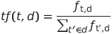
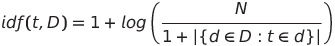
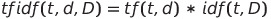

# Academic Search Engine ⭐

Information retrieval and its accuracy has proposed several challenges to scholars in our ever increasing data-centric world. As the data has increased, information has decreased and finding relevant information has become difficult concerning many spheres of life. We tackle one such problem in this paper regarding academic search of professors based on their research interests, publications, universities etc. The proposed search engine can be used by scholars to narrow down their search of universities, research areas or professors based on various criterias and preferences. The search engine can provide them a platform to evaluate various universities, research areas etc. before opting them in their career paths. 

Refer [here](https://drive.google.com/file/d/1weuCTmT9MVvDqZZ68M9xANl6u63Qjdta/view?usp=sharing) for our **project proposal**.

Refer [here](https://drive.google.com/file/d/16eVVmE6eEPuwG_MMWuHwdwqVMfqHndP6/view?usp=sharing) for our **presentation slides**.

Refer [here](https://drive.google.com/file/d/1A8WpnJwAm4MCMqe233OxC6aC5Cmtv0XX/view?usp=sharing) for **NeurIPS format**.

Refer [here](https://drive.google.com/file/d/1TX_nmBeafJQEglPLspJ0Dh92MW0P3sXk/view?usp=sharing) for **demonstration video** of our project. 

## Codebase Directory Architecture 📁
```
Search_Engine
├─ DS
│  ├─ Prof
│  │  ├─ __init__.py
│  │  ├─ index_file.lzma
│  │  ├─ prof
│  │  │  ├─ items.py
│  │  │  ├─ middlewares.py
│  │  │  ├─ pipelines.py
│  │  │  ├─ settings.py
│  │  │  └─ spiders
│  │  │     ├─ __init__.py
│  │  │     └─ prof_list.py
│  │  ├─ prof.csv
│  │  ├─ prof.json
│  │  ├─ scrapy.cfg
│  │  ├─ stopword.txt
│  │  └─ tf-idf.py
│  ├─ __init__.py
│  ├─ logo.png
│  ├─ settings.py
│  ├─ urls.py
│  ├─ views.py
│  └─ wsgi.py
├─ README.md
├─ __init__.py
├─ db.sqlite3
├─ logo.png
├─ manage.py
├─ static
│  ├─ CSS
│  │  ├─ bootstrap.minHistory.css
│  │  ├─ dark.css
│  │  ├─ light.css
│  │  └─ style.css
│  ├─ JS
│  │  ├─ darkmode.js
│  │  └─ main.js
│  └─ images
│     ├─ logo.png
│     ├─ not_found.png
│     └─ user_not.jpg
├─ templates
│  ├─ card.html
│  ├─ history.html
│  ├─ index.html
│  ├─ logo.png
│  ├─ main.css
│  ├─ register.html
│  └─ search.html
└─ user
   ├─ __init__.py
   ├─ admin.py
   ├─ apps.py
   ├─ migrations
   ├─ models.py
   ├─ tests.py
   └─ views.py
```
## Overall Structure 🔥
We now present the architectural overview of our search engine.


* The foundation of our architecture is based on the crawler which scrapes the relevant data of professors from the web and creates a JSON file containing their name, research interests, publications, Google scholar IDs, Homepage URLs etc. 
* For each of the available computer science professors. The specifics of the scraping procedure are provided the following sections. 
* The scraped data is then preprocessed by cleaning spaces, punctuations, removing stop words etc. and an index is created using the Term Frequency, Inverse Document Frequency (TF-IDF) procedure. 
* The index is stored in the server and used to serve client requests using the TF-IDF score. The dynamics of the engine come into action as the client starts typing the query. 
* The query engine asks the recommendation system for some recommendations for this specific user based on collaborative filtering run on the user's search history. 
* After getting the recommendations, the query is processed by the query engine and sent to the server. The server consults the index and returns the pages retrieved according to TF-IDF score to the query engine. 
* The query engine then ranks the results according to the searching criteria and serves the results to the client.

## Features and Use Cases ✅
```
✅ A user can select one of the 4 possible options for searching 
✅ Based on professor names, where the search will be solely
✅ Based on the names of the professors and nothing else.
✅ Based on research interests, where the search will match the 
    complete text entered as a query and the matching will only be 
    done on the research interests of the professors.
    For example, if one searches ‘data mining’ under the research
    interest field, then there will be no results matching ‘data’
    and ‘mining’ separately, whereas results for ‘data mining’ as
    a combined are shown. 

✅ Based on university name, the search results will again be
    solely matched on the university names. 
✅ A general search, which considers all the documents, on all 
    the words, and calculates the general score. 
```

## System Components :computer:

### Crawling  :baby:

The flow of the crawling processes can be seen in the figure.  This is the architectural diagram of scrapy package(python). We modified the spiders and the middleware as per the requirements of the crawling. 


Here are the steps we followed:

* Scraping the list of all the computer science professors fromwww.csranking.orginto a CSV file. This file contains around 22,000 entries, with a google scholarID for each entry.
* Using the scholarID’s we scraped the information about a professor from google scholar. The scraped information contained entries pertaining to name, university name, H-index,Publications, Research Interests etc. 
* This object of information is appended in a JSON file, which will serve as an input to the index creation process.
* Due to heavy traffic from the crawler, google scholar might try to block the crawler’s IP from accessing the webpages. To ensure that doesn’t happen, we used scrapy middlewares and limited the number of concurrent requests to 1, and added some optimal delay after each scraping.
* The middleware is nothing but a captcha solver. The code for captcha solver converts the captcha into a string, solves the string and returns back the solved image after converting the string back to image.


## Dataset Statistics :bar_chart:

The following is the summary of the dataset scrapped from different sources. The original dataset represents the dataset obtained from cs rankings. However, not all the professors from that set were on google scholar, therefore the final number of professor is a bit less

Other stats              |  Total Publications
:-------------------------:|:-------------------------:
 | 


## Index Creation :notebook:

* The scraped data in JSON file from the crawling step is loaded and preprocessed by removing stop words. Stop words are the set of commonly used words which need to be filtered out before processing the data so that the focus can be on important words.
* The data is also cleaned by removing spaces, punctuations and special characters using regular expressions and matching the patterns within the text. After preprocessing the data,it is used to create the TF-IDF score. For calculating the TF-IDF score, separate dictionaries for term frequency, document frequency and inverse document frequency are created.
* The term frequency of a word is the number of times a word appears in a document and the document frequency of a word is the number of documents containing that word. The dictionaries for term and document frequency keep the count as defined above.The term frequency tf(t,d) of term t in document d is given by <br/>

* To facilitate the use of different searching criteria, separate dictionaries are maintained for term and document frequency each for research interests, university names and professor names giving different weights to words. This is done so that exact results can be served to the user requesting for specific university names, professor names etc.
* The term frequency for each document is stored using the scholar ID’s of professors as keys in the dictionary. After the creation of term and document frequencies, inverse document frequency of each word is calculated.
* The inverse document frequency of a word is the measure of how rare or common the wordis in the whole corpus. It is calculated by taking logarithm of the total number of documents divided by the number of documents containing that word. The inverse document frequency idf(t,D) of term t in corpus D is given by<br/>

* Finally the TF-IDF score for each scholar ID is calculated using the formula:<br/>

* The TF-IDF scores are created for the four searching criteria provided in the search engine namely, professor name, university, research interest and general. The TF-IDF scores and the relevant information about the professors is stored as an object in the index.


## Server and Query Engine :fire_engine: 
After the creation of the index, the query engine can find the results for the search engine and rankthem appropriately.The queries entered by the user are served depending on various parameters. The following is a stepby step break-down of the process from user entering the queries to getting the results on the clientend:

* As the user starts typing the query, recommendations/suggestions are given by the recommendation system.
* The recommendation system shows recommendations based on a user’s search history and collaborative filtering.
* The recommendation system is explained in detail below. The basic idea behind collaborative filtering is to provide suggestions based on similarities between the users.
* The similarity between the users is calculated by the similarities between their search histories.
* The entered query is then cleaned and split into words separated by spaces except when the search is on research interests.
* The processed query is sent to the server where it is then used to calculate document score.
* The score of a document is increased exponentially as more and more words are matched from the tokenized query on the same document.
* For example, suppose we search for “Online coresets for clustering with Bregman divergences” and suppose document ‘A’ first matches with Bregman in the query and document ‘B’ matches with 3 previous words (say corsets, clustering and online) as well as with Bregman, then the word Bregman will have a weight of 2^0. in document ‘A’, and it will have a weight of 2^3 in document ‘B’.
* The exponential increase helps in filtering a lot of unnecessary results, which just happens to match some of the words from the query.
* The document score and some other parameters (h-index as of now) are then used to rank the documents by the query engine and the required number of results are returned to the client. 


## Ranking 🥇

The ranking of the returned results is done using two keys. The first is the document scores, and the second is the H-Index. This is a very basic ranking procedure, and can be improved in future.

## Recommendation :crystal_ball: 

### Collaborative Filtering

If a user finds similar interests with other groups of users, then the searches of the other similar users might be helpful for our user. This recommendation system tries to give suggestions based on the searches of users having a common interest.

* A collaborative recommendation system can help the user to search for more accurate queries. When typing in the search bar, it is pretty helpful if related searches appear on the go. Google and a majority of other search engines give their users suggestion systems that are much more sophisticated. They involve the geographical region, day, month, search history, collaborative filtering and many more things to produce the best suggestions. Scholaris also provides a collaborative filtering recommendation system for suggestions. For implementing this system, exclusively login and user authentication are provided. For each query, if the server finds that it produced some result, it will store that query in the user's search history. For every user, the server is storing the search history.
* First, create a vector of the search history of the user. It is a histogram of words made from the queries in the search history. Compute the same vector for all users. Find the similarity between each pair of users based on the total number of common words in the histogram/vector. For each user, find the K most similar users. Then create a user similarity matrix where every user has his/her ranking of similarity with other users.
* Whenever the user starts typing a query in the search bar, the client-side sends the query to the recommendation system on the server. The recommendation system already has the user similarity matrix. It gets the search history of all the users who were most similar to our user. Then the server matches the query string with the final extended search history and returns a list of suggestions to the client. The fast query response exchange between the client-server takes place with the help of XHR request. It is why the recommendation system works on the go with the typing user.
* Computing the user similarity matrix is time expensive. So the server periodically does the computation without compromising on the ongoing search requests.  That is why the results in the recommendation might take some time to change even if the user history gets changed in less time. We have not researched the faster update of recommendation systems and similarity matrix because our main goal was to make a search engine that produces good results. 


## Instructions to Run :runner:

* Install the prerequisites`scrapy`, `compress_pickle`, `simplejson`, `pytesseract`, `pyquery`, `pysummarization`, `dryscrape` using `pip install <package name>`.
* Note: For `dryscrape` to work the following command needs to be run, `apt-get update` followed by `apt-get install qt5-default libqt5webkit5-dev build-essential python-lxml`.
* To start scraping process run, `scrapy crawl prof_spider` in the `./DS/Prof/prof/spiders` directory. The file `prof.csv` containing scholar IDs of CS professors taken from www.csrankings.org should be present in `./DS/Prof` directory.
* After the scraping is finished a `prof.json` file is created in `./DS/Prof` directory, run the following command to create the index `python3 tf-idf.py` in the same directory. The above command creates an index file `index_file.lzma`.
* To run the server on localhost, install `Django` using `pip install django` command and run the command `python3 manage.py runserver` in the root directory. The search engine will be up and running at `http://localhost:8000`.

## References and Credits 💳

This project has been made as a part of project component of the course Introduction to Data Science offered at an academic institution under the guidance of a professor.

### Note: The aim of the project was not to build a UI. Therefore the website is not responsive. 

## Important Notes About This Repository 🔒

This repository has been sanitized for public release. The following changes have been made:

### Removed Sensitive Information:
- **Django Secret Key**: Replaced with placeholder
- **Personal Names**: All real professor names replaced with sample data
- **Institution Names**: All specific university names replaced with generic placeholders
- **Course Information**: Removed specific course codes and academic year details
- **Live URLs**: Removed production deployment URLs
- **Database**: Removed `db.sqlite3` containing user data
- **Data Files**: Replaced real professor data with sample data

### Files Modified:
- `DS/settings.py`: Secret key replaced
- `README.md`: Personal and institutional information removed
- `templates/card.html`: Sample professor data instead of real data
- `DS/Prof/prof.csv`: Sample data instead of real professor information
- `DS/Prof/prof.json`: Sample data instead of real professor information
- `DS/Prof/index_file.lzma`: Replaced with placeholder text file

### Setup Instructions for New Users:

1. **Install Dependencies**:
   ```bash
   pip install scrapy compress_pickle simplejson pytesseract pyquery pysummarization dryscrape django
   ```

2. **Generate New Secret Key**:
   ```bash
   python -c "from django.core.management.utils import get_random_secret_key; print(get_random_secret_key())"
   ```
   Replace the placeholder in `DS/settings.py` with the generated key.

3. **Initialize Database**:
   ```bash
   python manage.py makemigrations
   python manage.py migrate
   ```

4. **Add Your Own Data**:
   - Replace `DS/Prof/prof.csv` with your professor data
   - Replace `DS/Prof/prof.json` with your professor data
   - Run the TF-IDF indexing script to generate `index_file.lzma`

5. **Run the Application**:
   ```bash
   python manage.py runserver
   ```

### Security Notes:
- Always generate a new Django secret key for production
- Never commit sensitive data files to version control
- Use environment variables for sensitive configuration
- The `.gitignore` file has been updated to prevent accidental commits of sensitive files 
